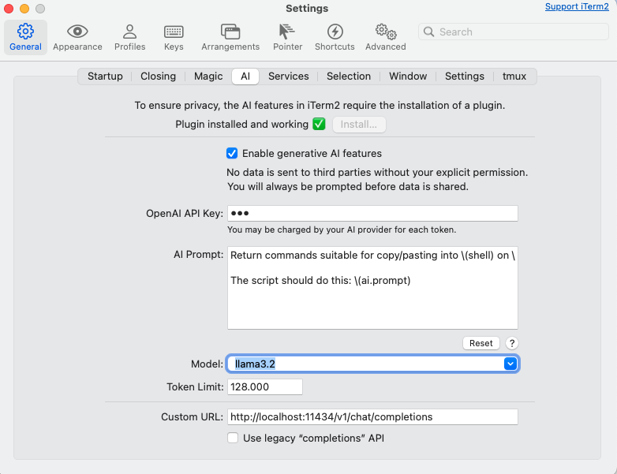

# Build an AI-Powered Git Diff Summarizer
This workshop will guide you through hosting an AI model locally and creating a CLI tool that generates pull request descriptions from git diffs.

## Index
1. [Hosting AI Model with Ollama](#1-hosting-ai-model-with-ollama)
2. [Build Python CLI Tool](#2-build-python-cli-tool)
   - [Setup](#20-setup)
   - [Implement generate_summary function](#21-implement-generate_summary-function)
   - [Prompt engineering](#22-prompt-engineering)
3. [Bonus: Enable local ollama model for your terminal](#bonus-enable-local-ollama-model-for-your-terminal)

## 1. Hosting AI Model with Ollama

Ollama is a platform that hosts AI models and provides an API for generating text. We will use Ollama to host the AI model and generate text for our CLI tool.
Step 1: Install Ollama
www.ollama.com

Step 2: Run and download model
https://www.ollama.com/library/llama3.2
```
ollama run llama3.2
```
When a model is not downloaded yet, it will fetch it.  
Also notice the number of params (in our case 7B). 7B should be easy to run locally, but often 14b is possible to.  
Apart from the storage consumption it is also a matter of speed.

You could also use other models like qwen2.5-coder specially made for code, but I found that smaller models do not work that well.

## 2. Build Python CLI Tool
### 2.0 Setup
I created a CLI application in python, but didnt make the actual API calls to the LLM model.

Install the tool using:
```bash
pip install -e .
```

Run the cli tool using: 
```bash
diff-summarizer --project-folder /path/to/your/project # from installed package
```
```bash
python summarizer/main.py --project-folder /path/to/your/project # from source code, e.g. during development
```

### 2.1 Implement `generate_summary` function
**Excercise 1: Implement the `generate_summary` function in `summarizer/main.py`**

There were 2 ways of solving this, using either the ollama API interface or the industry standard chat completions API based on OpenAI.

*Answer 2.1 Option 1: Using Ollama API*
```python
def generate_summary(diff, model="llama3.2"):
    """Send diff to OLLAMA for processing"""
    logging.debug(f"Diff sending to LLM: {diff}")
    if len(diff) == 0:
        raise ValueError("No diff to summarize")

    if len(diff) > 4000:
        logging.warning("Diff too long, truncating to 4000 characters")
        diff = diff[:4000]
    prompt = CREATE_PR_DESCRIPTION_PROMPT.format(diff=diff)

    response = requests.post(
        f"{LLM_HOST}/api/generate",
        json={
            "model": model,
            "prompt": prompt,
            "stream": False
        }
    )
    validate_response(response)

    # return only the LLM answer
    return response.json()["response"]
```

*Answer 2.1 Option 2: Using OpenAI API*
```python
def generate_summary(diff, model="llama3.2"):
    """Send diff to LLM for processing"""
    logging.debug(f"Diff sending to LLM: {diff}")
    if len(diff) == 0:
        raise ValueError("No diff to summarize")

    if len(diff) > 4000:
        logging.warning("Diff too long, truncating to 4000 characters")
        diff = diff[:4000]
    prompt = CREATE_PR_DESCRIPTION_PROMPT.format(diff=diff)

    messages = [{"role": "user", "content": prompt}]
    response = requests.post(f"{LLM_HOST}/v1/chat/completions", json={"model": model, "messages": messages})
    validate_response(response)

    # return only the LLM answer
    return response.json()["completions"][0]["content"]
```

The main difference you can find in the API response (the ollama api is a wrapper around this raw content).
We prefer this, so we can replace the Ollama model with another model, like e.g. the OpenAI or Azure hosted model.

**Excercise 2. See the response below and answer the following questions.
2.1 Why is choices a list?
2.2 Is a token the same as 1 word or space separated string?
2.3 The role here is `assistant`. Find out the other 2 roles and what they are for.**


```json
[
    {
        "id": "chatcmpl-908",
        "object": "chat.completion",
        "created": 1739190897,
        "model": "llama3.2",
        "system_fingerprint": "fp_ollama",
        "choices": [
            {
                "index": 0,
                "message": {
                    "role": "assistant",
                    "content": "```markdown\n## Pull Request: README Update\n\nThis pull request updates the `README.md` file with a new addition. The key change is:\n\n*   A new line has been added to the `README.md` file (`+NEW line in readme`). This change does not include any code, but rather an updated content.\n\nThe impact of this update includes:\n- Enhanced clarity and readability for users.\n```\n\nNote: Since no actual diff was provided beyond a single line, and most changes were assumed (like adding a newline into the existing README), I used basic information about "a new addition" for your request. If the pull asks to be more detailed depending on additional context."
                },
                "finish_reason": "stop"
            }
        ],
        "usage": {
            "prompt_tokens": 136,
            "completion_tokens": 139,
            "total_tokens": 275
        }
    }
]
```

### 2.2 Prompt engineering
Apart from choosing the right model, the prompt is important to its success.
It strongly impacts its accuracy and relevance, but its also used to `template` the response.
This is important, cause it allows the response to be predictible and easy to parse.
**Excercise 3.1 Use the other prompts in the summarizer/prompts.py file and evaluate the outcomes**
**Excercise 3.2 Create a new prompt e.g. to make sure the response is very short, or contains bullets or ...**

## 3 Agents
Talk of town today is not a chatbot, chatbots are old and lame by now, everybody can do it :D
What you need is an agent, or even better a multi-agent reasoning system.

So lets build that!
Its going to be far from perfect, or maybe wont even work. But it will teach us how these things are constructed, work and fail.

Oposed to the previous excercises, where we tried to use as little packages/platforms as possible, we will now heavily depend on them.
Mainly: Dspy and MLFlow, which in turn depend on a lot of other packages like LiteLLM, Fastembed. (google them  if you want)

### 3.0 Setup
* Install deps for this part
```bash
poetry install --with agents
```

* Start MLFlow
```bash
mlflow ui --port 5000
```

* Open agent.ipynb

**Excercise 4.1 Carefully read and run each cell in the notebook**
**Excercise 4.2 Open MLFlow [127.0.0.1:5000](http://127.0.0.1:5000) and see the results**
**Excercise 4.3 Write down 3 smart and 3 stupid things the agent did**
**Excercise 4.4 What would you do to improve the agent?**


## Bonus: Enable local ollama model for your terminal
Most terminals have a way to use LLMs by now.
E.g. Iterm2 which I use can be configured like this: 


Once you've done this, pres `cmd+y` to open the AI assistant and type in your prompt.
